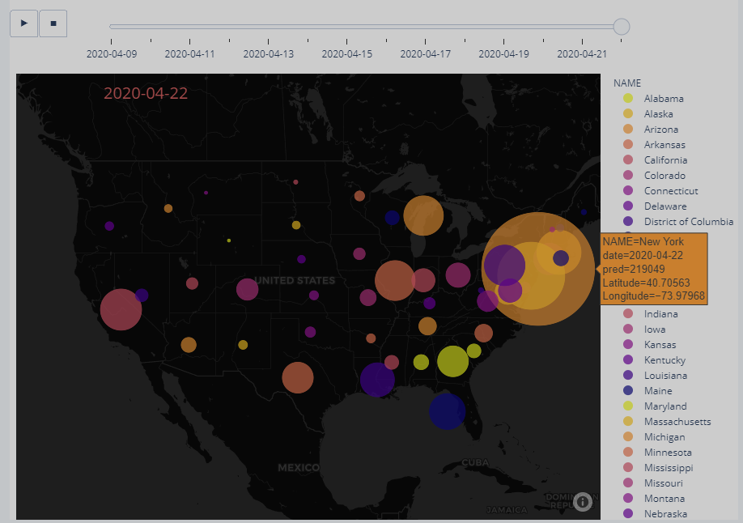

# DSComputing
Some experiments/explorations related to Data Science Computing. Especially covid-19 projections with RNN, and visualizations with interactive map tracker and predictions.

## Project organization
* experiments: folder containing experiments on web scrapping, large file and/or texts manipulation etc.
* covid-19: the project folder employing:
  * web scrapping on US state-level cases: [Johns Hopkins CSSE data](https://github.com/CSSEGISandData/COVID-19), state-level population census:[Census Bureau](https://www.census.gov/data/tables/time-series/demo/popest/2010s-state-total.html), state-level daily weather: [World Weather Online](https://www.worldweatheronline.com),  and state-level policy measures and timeframe: [COVID19StatePolicy](https://github.com/COVID19StatePolicy/SocialDistancing)
  * RNN (LSTM/GRU) model prediction of cases forcasted 1 day into the future, pytorch implementation
  * visualization of historical trends and predictions with interactive map plot. You can view a short demo [here](https://plotly.com/~GinnyJZ/74/#plot)
* notes: folder containing some starter code courtesy of Dr.Luo Xi

## Built With
* [pytorch](https://pytorch.org/) - The major modeling tool
* [plotly](https://plotly.com/) - The major graphing tool
* [wwo-hist](https://github.com/ekapope/WorldWeatherOnline) - The major tool for pulling weather data 
* [bs4](https://www.crummy.com/software/BeautifulSoup/bs4/doc/) - The major tool for pulling data from the html
* [pandas](https://pandas.pydata.org) - The major data cleaning tool
* Many others, thank you

## Authors 
**Ginny** [chocolocked](https://github.com/chocolocked)

## Acknowledgments
* Hat tip to [Dr.Luo Xi](https://github.com/rluo) for getting me started, to **Ran Cremer** for his awesome [post](https://towardsdatascience.com/using-kalman-filter-to-predict-corona-virus-spread-72d91b74cc8), to [New York Times](https://www.nytimes.com/interactive/2020/us/coronavirus-us-cases.html) for their inspirations

